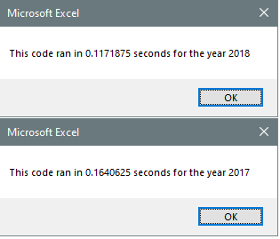

# Stock Analysis with VBA

## Purpose
The purpose of this project was to refactor a piece of VBA code to run more efficiently. The code itself observes various stock opportunities and analyzes them over 2017 and 2018 to explore which companies might be worth investing in.

## Results
Almost everyone was getting positive returns in 2017. The only two companies to continue the trend in 2018 were ENPH and RUN. RUN and TERP were the only companies to increase their percentage returns from 2017 to 2018, however TERP posted straight losses both years. The execution times of the refactored code was quicker by a factor of seven or greater. Run time for the unoptimized code was anywhere from .8 to .85 seconds, whereas the refactored code ran in the .1 to .13 range. The optimized subroutine is as follows:

    Sub AllStocksAnalysisRefactored()
    Dim startTime As Single
    Dim endTime  As Single

    yearValue = InputBox("What year would you like to run the analysis on?")

    startTime = Timer
    
    Worksheets("All Stocks Analysis").Activate        'Format the output sheet on All Stocks Analysis worksheet
    
    Range("A1").Value = "All Stocks (" + yearValue + ")"
    
    Cells(3, 1).Value = "Ticker"
    Cells(3, 2).Value = "Total Daily Volume"
    Cells(3, 3).Value = "Return"                                                           'Create a header row
    
    
    Dim tickers(12) As String                                                  'Initialize array of all tickers
    tickers(0) = "AY"
    tickers(1) = "CSIQ"
    tickers(2) = "DQ"
    tickers(3) = "ENPH"
    tickers(4) = "FSLR"
    tickers(5) = "HASI"
    tickers(6) = "JKS"
    tickers(7) = "RUN"
    tickers(8) = "SEDG"
    tickers(9) = "SPWR"
    tickers(10) = "TERP"
    tickers(11) = "VSLR"
    
    Worksheets(yearValue).Activate                                                     'Activate data worksheet
    
    RowCount = Cells.Find("*", searchorder:=xlByRows, searchdirection:=xlPrevious).Row
    'Get the number of rows to loop over
    
    tickerIndex = 0                                                                  '1a) Create a ticker Index

    Dim tickerVolumes(12) As Long
    Dim tickerStartingPrices(12) As Single
    Dim tickerEndingPrices(12) As Single                                        '1b) Create three output arrays
    
    
    For i = 0 To 11
        tickerVolumes(i) = 0
        tickerStartingPrices(i) = 0
        tickerEndingPrices(i) = 0
    Next i                                      '2a) Create a for loop to initialize the tickerVolumes to zero.
    
        
    For j = 2 To RowCount                                       '2b) Loop over all the rows in the spreadsheet.
        tickerVolumes(tickerIndex) = tickerVolumes(tickerIndex) + Cells(j, 8).Value
        '3a) Increase volume for current ticker
        
        If Cells(j, 1).Value = tickers(tickerIndex) And Cells(j - 1, 1).Value <> tickers(tickerIndex) Then
            tickerStartingPrices(tickerIndex) = Cells(j, 6).Value
        End If
        '3b) Check if the current row is the first row with the selected tickerIndex.
        
        If Cells(j, 1).Value = tickers(tickerIndex) And Cells(j + 1, 1).Value <> tickers(tickerIndex) Then
            tickerEndingPrices(tickerIndex) = Cells(j, 6).Value
            tickerIndex = tickerIndex + 1
        End If
        '3c) check if the current row is the last row with the selected ticker
        'If the next row’s ticker doesn’t match, increase the tickerIndex.
    
    Next j
    
    For m = 0 To 11
        
        Worksheets("All Stocks Analysis").Activate
        
        Cells(4 + m, 1).Value = tickers(m)
        Cells(4 + m, 2).Value = tickerVolumes(m)
        Cells(4 + m, 3).Value = tickerEndingPrices(m) / tickerStartingPrices(m) - 1
        
    Next m                   '4) Loop through your arrays to output the Ticker, Total Daily Volume, and Return.
    
    Worksheets("All Stocks Analysis").Activate
    Range("A3:C3").Font.FontStyle = "Bold"
    Range("A3:C3").Borders(xlEdgeBottom).LineStyle = xlContinuous
    Range("B4:B15").NumberFormat = "#,##0"
    Range("C4:C15").NumberFormat = "0.0%"
    Columns("B").AutoFit                                                                            'Formatting

    dataRowStart = 4
    dataRowEnd = 15

    For n = dataRowStart To dataRowEnd
        
        If Cells(n, 3) > 0 Then
            
            Cells(n, 3).Interior.Color = vbGreen
            
        Else
        
            Cells(n, 3).Interior.Color = vbRed
            
        End If
        
    Next n
 
    endTime = Timer
    MsgBox "This code ran in " & (endTime - startTime) & " seconds for the year " & (yearValue)

    End Sub

## Summary 
The obvious advantage of refactoring code is that it is much quicker to execute. For particularly large datasets, this is crucial. Additionally, the refactored code is generally easier to read, and more pleasant to look at. This is helpful for teams that have to collaborate on a single piece of code. The disadvantage is that the refactored code generally is an additional iteration of a program that’s already been written. Meaning that refactoring is technically more work than just getting it right the first time. 
As it pertains to our project, the quicker execution was the sought-after result. As far as doing more work, that was inevitable in this academic case. 

